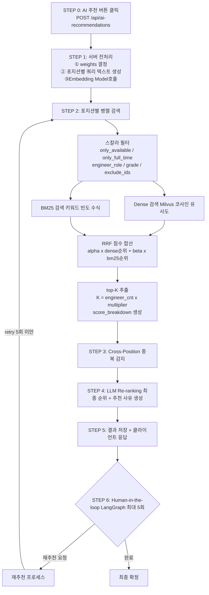
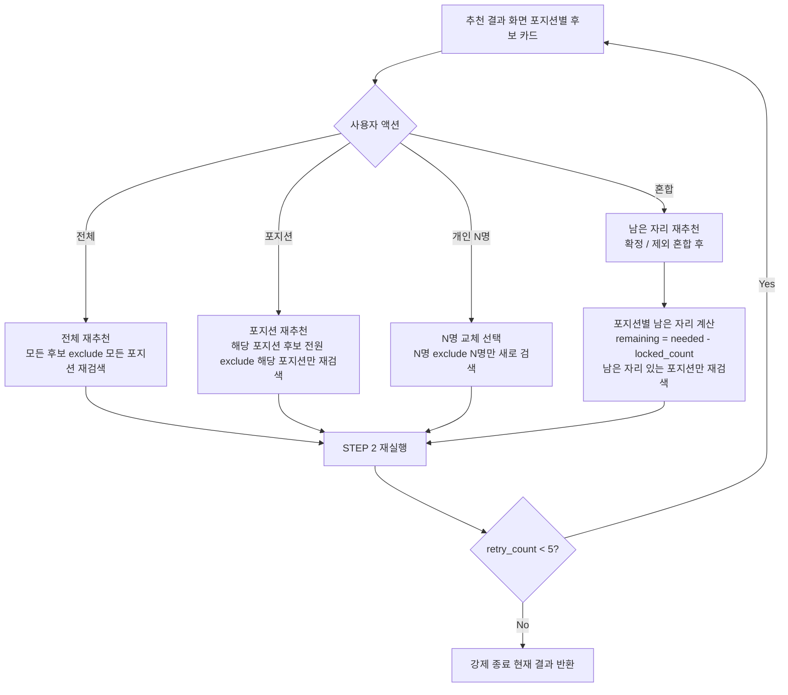
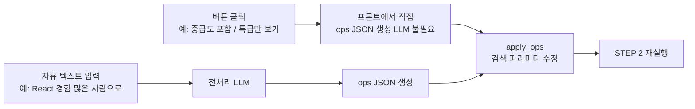

## 클라이언트 입력

```json
{
  "project_name": "현대차 ERP 시스템 개발",
  "description": "제조업 ERP 시스템 재구축 프로젝트",
  "start_date": "2026-04-01",
  "end_date": "2026-09-30",
  "total_headcount": 6,
  "only_available": true,
  "only_full_time": true,
  "weights": { "capability": 0.6, "experience": 0.4 },
  "positions": [
    {
      "position": "PL",
      "engineer_role": "DEVELOPER",
      "grades": ["SENIOR", "INTERMEDIATE"],
      "skills": ["Java", "Spring"],
      "engineer_cnt": 1,
      "etc": "팀장 역할 필수"
    },
    {
      "position": "백엔드 개발자",
      "engineer_role": "DEVELOPER",
      "grades": ["SENIOR", "INTERMEDIATE"],
      "skills": ["Java", "Spring"],
      "engineer_cnt": 3,
      "etc": "현대차 프로젝트 경험 우대"
    },
    {
      "position": "프론트엔드 개발자",
      "engineer_role": "DEVELOPER",
      "grades": ["SENIOR", "INTERMEDIATE"],
      "skills": ["React"],
      "engineer_cnt": 2,
      "etc": "차트.js 경험 우대"
    }
  ]
}
```

> `only_available`, `only_full_time` — 필수 필터. 미전달 시 서버에서 기본값 `true` 강제 적용. 투입 불가 / 프리랜서 추천은 배정 프로세스를 깨뜨림
> 

> `engineer_role` — 클라이언트가 직접 지정. Milvus 스칼라 필터로 직접 사용됨
> 

> `grades`, `skills`, `etc` — 선택값. 미입력 시 해당 조건 없이 넓게 검색. 결과 품질은 클라이언트 책임
> 

> `weights` — 1depth 기본값. 서버가 포지션 성격에 따라 내부 재계산 가능
> 

---

## position vs engineer_role 구분

두 필드는 개념 레이어가 다르다.

| 필드 | 의미 | 형태 | 용도 |
| --- | --- | --- | --- |
| `engineer_role` | 이 사람이 **무엇인가** (직군) | ENUM | Milvus 스칼라 필터 |
| `position` | 이 프로젝트에서 **무엇을 하는가** (직책) | VARCHAR | experience_text 시맨틱 |

PL이 대표적인 예시 — `engineer_role = DEVELOPER` 이지만 프로젝트에서 `position = "PL"` 역할을 맡는다. 같은 DEVELOPER가 다음 프로젝트에선 백엔드 개발자로 들어갈 수 있다.

**position → engineer_role 참고 매핑**

| position 입력 | engineer_role |
| --- | --- |
| PL, SA, TL, 백엔드, 프론트, 풀스택 | DEVELOPER |
| PM, 기획자, PO | PLANNER |
| QA, 테스트리드 | QA |
| 디자이너, UI, UX | DESIGNER |
| 매핑 불분명 (아키텍트 등) | 스칼라 필터 생략 → 벡터 유사도 위임 |

---

## 밀집 벡터(Dense) vs 희소 벡터(Sparse) 이해

### 밀집 벡터 (Dense Vector) — Gemini Embedding

텍스트를 **의미(Semantic)**로 변환한 숫자 배열. 신경망 모델이 문장 전체의 맥락을 이해해 768개 숫자로 압축한다.

```
"Java Spring Boot 백엔드 개발자"
        ↓ Gemini Embedding (신경망)
[0.12, -0.43, 0.87, 0.21, ...] (768개 숫자 — 전부 값이 있음)

특징: 모든 차원에 값이 존재 → "밀집(Dense)"
장점: 의미가 비슷한 것을 찾음 ("서버 개발자" ↔ "백엔드 개발자" 매칭)
단점: 정확한 기술명 구분이 약함 ("React" ↔ "React Native" 혼동 가능)
```

### 희소 벡터 (Sparse Vector) — BM25

수식으로 **키워드 등장 빈도**를 점수화한 방법. 신경망 없음, 모델 없음, 순수 수식 계산.

```
"Java Spring Boot 백엔드 개발자"
        ↓ BM25 수식 (신경망 없음)
{ "java": 2.1, "spring": 1.8, "boot": 1.5, "백엔드": 2.3 }
(등장하지 않은 수만 개 단어는 전부 0 → "희소(Sparse)")

특징: 대부분의 값이 0, 등장한 단어만 점수 존재
장점: 정확한 키워드 매칭 ("React Native" ↔ "React Native" 정확히 찾음)
단점: 의미 이해 없음 ("서버 개발자"를 "백엔드"로 못 찾음)
```

---

### ⚠️ 밀집 벡터(Dense)만 사용할 때 — 실제 문제 예시

**문제 1: 비슷한 기술을 같다고 봄**

```
PM 요청: "React Native 모바일 개발자 필요"

엔지니어 A: "React Native, iOS, Android 앱 개발 5년"   ← 정답
엔지니어 B: "React.js, Vue.js 웹 프론트엔드 개발 8년"   ← 오답

Dense 결과:
  1위 → 엔지니어 B  ← ❌ 오답이 상위
  2위 → 엔지니어 A  ← ✅ 정답인데 밀림

이유: Dense 모델은 "React Native"와 "React.js"를
     같은 React 생태계로 의미 유사도 높게 처리
```

**문제 2: 유사 기술을 동일 기술로 오인**

```
PM 요청: "Kubernetes 클러스터 운영 경험자"

엔지니어 A: "Kubernetes, Helm, ArgoCD 인프라 운영 4년"   ← 정답
엔지니어 B: "Docker, AWS ECS 컨테이너 배포 개발 6년"     ← 다른 기술

Dense 결과:
  1위 → 엔지니어 B  ← ❌ Docker/ECS는 Kubernetes가 아님
  2위 → 엔지니어 A
```

---

### ⚠️ 희소 벡터(BM25)만 사용할 때 — 실제 문제 예시

**문제 1: 같은 의미인데 키워드가 다르면 못 찾음**

```
PM 요청: "백엔드 시니어 개발자"

엔지니어 A: "백엔드 개발자, Java 8년 경력"              ← BM25 잘 찾음 ✅
엔지니어 B: "서버 개발 전문가, API 설계 및 구현 10년"   ← BM25 못 찾음 ❌

이유: 엔지니어 B 프로필에 "백엔드"라는 단어가 없음
     → 더 우수한 엔지니어를 놓치는 상황
```

**문제 2: 도메인/맥락 검색 불가**

```
PM 요청 etc: "제조업 ERP 도메인 경험 우대"

엔지니어 A: "제조업 ERP 시스템 개발 5년"                     ← BM25 잘 찾음 ✅
엔지니어 B: "자동차 부품 공장 생산관리 시스템 개발 7년"       ← BM25 못 찾음 ❌

이유: 사실상 제조업 ERP 전문가이지만 키워드 부재로 점수 = 0
```

---

### ✅ Dense + BM25 하이브리드 — 결합 효과

| 상황 | Dense만 | BM25만 | 하이브리드 |
| --- | --- | --- | --- |
| "React Native" 검색 | React.js가 상위 올 수 있음 | 정확히 찾음 | ✅ 정확히 찾음 |
| "백엔드 개발자" 검색 | 잘 찾음 | "서버 개발자" 못 찾음 | ✅ 둘 다 찾음 |
| "제조업 경험자" 검색 | 어느 정도 찾음 | 키워드 없으면 놓침 | ✅ 보완됨 |
| "Kubernetes 운영" 검색 | Docker로 혼동 가능 | 정확히 찾음 | ✅ 정확히 찾음 |

> **Dense = 의미로 넓게 커버 / BM25 = 정확한 기술명 보완 / RRF = 두 점수 합산**
> 

---

## 콜렉션 구조

```
━━ 스칼라 필터
engineer_id      VARCHAR(36)    ← engineer.id
grade            VARCHAR(20)    ← engineer.grade
status           VARCHAR(20)    ← engineer.status
engineer_role    VARCHAR(20)    ← engineer.engineer_role
employment_type  VARCHAR(20)    ← engineer.type
department_id    VARCHAR(36)    ← employee.department_id

━━ 벡터
capability_embedding   FLOAT_VECTOR(768)   ← 기술스택 + 자격증
experience_embedding   FLOAT_VECTOR(768)   ← 소개 + 프로젝트 경험 + 경력

━━ 원본 텍스트
capability_text  VARCHAR(2000)
experience_text  VARCHAR(65535)

━━ 관리
updated_at       INT64          ← Unix timestamp
```

인덱스: 벡터 HNSW (M=16, efConstruction=256) / 스칼라: grade, status, engineer_role, employment_type, department_id

**RDB 소스 매핑**

| 텍스트 필드 | 소스 테이블 |
| --- | --- |
| `capability_text` | engineer_skill JOIN skill, engineer_certification JOIN certification |
| `experience_text` | [engineer.bio](http://engineer.bio), engineer_project_experience (최근 5개), engineer_career |

---

## 콜렉션 벡터 임베딩 텍스트

**capability_text** — 스킬명 + 자격증만. 카테고리별 그룹핑. 다른 정보 없음.

```
Java / Spring Boot / Spring Security / JPA
PostgreSQL / Redis / MySQL
AWS / Docker / Kubernetes / Jenkins
Kafka

정보처리기사 / AWS SAA
```

**experience_text** — 스킬명 제외. 도메인 / 경험 / 역할 맥락만.

```
[소개]
MSA 아키텍처 기반 백엔드 전문. 제조업/물류 도메인 경험 다수.

[프로젝트 경험]
현대차(2024~2025): 딜러 관리 포털 백엔드 개발. JWT 인증 모듈 구현. 포지션: 백엔드 개발자.
SK하이닉스(2022~2024): 생산 관리 시스템 API 개발. Kafka 이벤트 처리. 포지션: 백엔드 개발자.
스타트업(2020~2022): 쇼핑몰 주문 시스템 개발. 포지션: 풀스택 개발자.

[경력]
현대오토에버(2019~2020): 백엔드 개발자. ERP 연동 API 개발.
```

---

## 쿼리 텍스트 구성

클라이언트 JSON → 포지션별 쿼리 텍스트 변환 후 임베딩

```python
def build_capability_query(position):
    return " / ".join(position["skills"])   # "Java / Spring"

def build_experience_query(project, position):
    parts = [f"[프로젝트] {project['name']}: {project['description']}"]
    parts.append(f"[포지션] {position['position']}")
    if position.get("etc"):
        parts.append(f"[요건] {position['etc']}")
    return "\n".join(parts)
```

> 프로젝트 `description` 을 experience_query에 반드시 포함 — 도메인 키워드(현대차, 제조업, ERP)가 벡터 유사도에 결정적 영향
> 

---

## 가중치(weights) 전략

`weights` 는 클라이언트가 1depth로 전달하는 전체 흐름의 기본값. 서버는 클라이언트 요청에 따라 가중치를 설정하고 기본은 0.5 : 0.5

| 포지션 성격 | capability | experience |
| --- | --- | --- |
| Backend / Front (스킬 중심) | 0.7 | 0.3 |
| PL / PM (경험 중심) | 0.2 | 0.8 |
| QA (균등) | 0.5 | 0.5 |

---

## 전체 프로세스 FLOW



---

## 재추천 프로세스

### UI 액션 레벨

포지션은 재추천의 핵심 단위. 액션은 3개 레벨로 구분된다.

| 레벨 | 버튼 | 동작 |
| --- | --- | --- |
| 전체 | 전체 재추천 | 모든 포지션 후보 전원 exclude → 전 포지션 재검색 |
| 포지션 | 포지션 재추천 | 해당 포지션 후보 전원 exclude → 해당 포지션만 재검색 |
| 개인 | N명 교체 (❌ 선택) | 선택한 N명 exclude → 해당 포지션에서 N명만 새로 검색 |
| 혼합 | 남은 자리 재추천 | ✅ 확정 / ❌ 제외 혼합 후 남은 자리 있는 포지션만 재검색 |

### ✅ 확정 vs ❌ 제외

```
✅ 확정   →  "이 사람 쓸게"   →  자리가 채워짐 (locked)     남은 자리 줄어듦
❌ 제외   →  "이 사람 싫어"   →  블랙리스트 등록 (excluded)  자리 수는 그대로, 풀만 줄어듦
```

**혼합 시나리오 예시:**

```
PL      2명 필요  /  홍길동 ✅  →  locked[PL] = [홍길동]  →  남은 자리 1명  →  재검색
백엔드  3명 필요  /  박민수 ✅  →  locked[백엔드] = [박민수]  →  남은 자리 2명  →  재검색
프론트  2명 필요  /  손 안 댐  →  남은 자리 없음 (아직 판단 전)  →  재검색 안 함

exclude_ids = locked 전원 + excluded 전원 + 현재 노출된 전원
```

### 재추천 흐름



### LangGraph State

```python
class RecommendationState(TypedDict):
    request:     dict        # 원본 클라이언트 요청 (불변)
    candidates:  dict        # 현재 추천 결과 { position: [후보...] }
    locked:      dict        # 확정   { position: [engineer_id...] }
    excluded:    list[int]   # 제외   전역 블랙리스트
    retry_count: int         # 재추천 횟수 (최대 5)
    ops:         list        # Structured Ops (조건 변경 시)
```

---

## Structured Ops

사용자 재추천 요청을 구조화된 JSON 명령(Operations)으로 변환해 검색 파라미터를 수정한다. 기존 조건은 유지하고 변경된 부분만 패치 적용된다.

### 트리거 방식



> 버튼 = LLM 없이 즉시 ops 생성 (비용 절감, 80% 케이스 커버)
> 

> 자유 텍스트 = 전처리 LLM 1회 호출 후 동일 파이프라인 처리
> 

### 자유 텍스트 전처리 예시

```
사용자: "React 경험 많은 사람으로 바꿔줘"

전처리 LLM 출력:
{
  "ops": [
    { "op": "boost_skill",   "skill": "React", "target": "experience", "factor": 2.0 },
    { "op": "change_weight", "capability": 0.3, "experience": 0.7 },
    { "op": "llm_hint",      "hint": "React 프로젝트 경험이 많고 기간이 긴 사람 우선" }
  ]
}

→ 단일 텍스트가 여러 ops 조합으로 변환
→ apply_ops() 가 순서대로 기존 파라미터에 패치 적용
→ 기존 grade / exclude_ids / engineer_role 조건은 그대로 유지
```

### 🔴 Filter Ops — 스칼라 필터 변경

| Op | 설명 | 트리거 예시 |
| --- | --- | --- |
| `set_grade` | 등급 교체 | "특급만 보여줘" |
| `add_grade` | 등급 추가 | "중급도 포함해줘" |
| `remove_grade` | 등급 제거 | "주니어 빼줘" |
| `set_only_available` | 투입가능 여부 변경 | "투입중인 사람도 같이 보여줘" |
| `set_only_full_time` | 정규직 여부 변경 | "프리랜서도 포함해줘" |

### 🟡 Skill Ops — 스킬 조건 변경

| Op | 설명 | 트리거 예시 |
| --- | --- | --- |
| `add_skill` | 스킬 추가 | "TypeScript도 추가해줘" |
| `remove_skill` | 스킬 제거 | "Spring 빼고 검색해줘" |
| `boost_skill` | 스킬 강조 (쿼리 반복 삽입 → 벡터 방향 이동) | "AWS 경험 있는 사람 위주로" |
| `require_skill` | 스킬 필수화 (BM25 must-match) | "Kubernetes 필수로" |

### 🟢 Weight Ops — 가중치 변경

| Op | 설명 | 트리거 예시 |
| --- | --- | --- |
| `change_weight` | capability / experience 비중 조정 | "스킬보다 경험 위주로" |

### 🔵 Exclusion Ops — 제외 처리

| Op | 설명 | 트리거 예시 |
| --- | --- | --- |
| `exclude_engineer` | 특정 엔지니어 제외 | ❌ 버튼 클릭 |
| `exclude_department` | 특정 부서 제외 | "영업팀 소속은 빼줘" |
| `include_only_department` | 특정 부서만 포함 | "개발1팀 인원만 보여줘" |

### 🟣 Scope Ops — 검색 범위 조정

| Op | 설명 | 트리거 예시 |
| --- | --- | --- |
| `expand_candidates` | top-K 배수 증가 (후보 더 많이) | "후보 더 많이 보여줘" |
| `update_etc` | 요건 텍스트 수정 (experience_query 변경) | "PL 조건에 현대차 경험도 추가해줘" |
| `change_engineer_cnt` | 포지션 필요 인원 변경 | "백엔드 1명 더 필요해졌어" |

### ⚪ LLM Hint Ops — 벡터로 표현 불가한 조건

| Op | 설명 | 트리거 예시 |
| --- | --- | --- |
| `llm_hint` | LLM re-ranker에게 자연어 지시 전달 | "현대차 경험 있는 사람 위로" / "프로젝트 3개 이상인 사람으로" |

> `llm_hint` = 벡터 검색이 수치화 못하는 조건을 LLM re-ranking 단계에서 반영
> 

---

## 중복 후보 처리

포지션별 독립 검색 시 동일 엔지니어가 여러 후보군에 중복 등장 가능.

**전략: 포지션별 독립 추출 → LLM이 중복 해소**

중복 감지 후 LLM 프롬프트에 명시:

```
"홍길동(E1)은 PL / Backend 양쪽 후보에 포함됨.
전체 포지션 요건을 고려하여 가장 적합한 포지션을 판단하고,
나머지 포지션에서는 순위를 낮추거나 대체 후보를 제시할 것."
```

Greedy Exclusion(순서 의존) 이나 Hungarian Algorithm(배치 확정용 과사양) 대신 LLM 위임을 선택한 이유:

- 시스템이 이미 Human-in-the-loop 구조 (LangGraph, 최대 5회 재추천)
- 전체 포지션 맥락을 보고 판단하는 LLM이 규칙 기반보다 정확
- 중복 자체가 "여러 포지션에 적합한 우수 인재"라는 유의미한 신호

---

## 임베딩 갱신 기준

| 변경 이벤트 | capability | experience | 스칼라 |
| --- | --- | --- | --- |
| 스킬 추가 / 삭제 | **재임베딩** | — | — |
| 자격증 추가 / 삭제 | **재임베딩** | — | — |
| 프로젝트 경험 추가 / 수정 | — | **재임베딩** | — |
| 경력 / 소개 수정 | — | **재임베딩** | — |
| status / grade 변경 | — | — | **스칼라만 업데이트** |